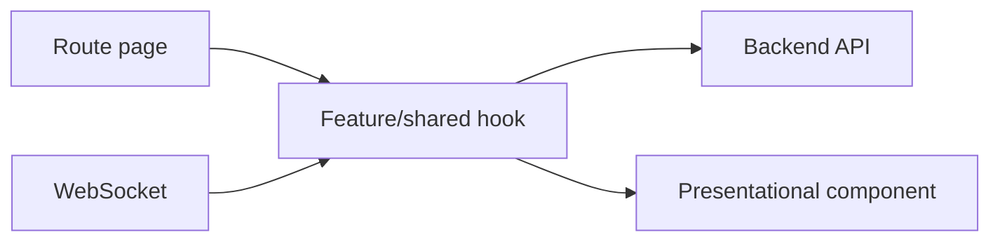

# Kiến trúc frontend

## Cấu trúc

| Thư mục | Trách nhiệm |
|---|---|
| `src/pages/<role>` | Route container theo vai trò |
| `src/components` | Component dùng chung theo nhóm |
| `src/features/<domain>` | UI, hook và mapper được tách từ page lớn |
| `src/hooks` | Hook dùng chung hoặc hook API hiện hữu |
| `src/services` | API client dùng chung |
| `src/constants` | Route và hằng số ứng dụng |
| `src/locales` | Nguồn i18n duy nhất |
| `src/utils` | Hàm thuần dùng ở nhiều domain |

## Luồng dữ liệu

- Route page kiểm tra tham số, ghép layout và điều phối trạng thái trang.
- Hook chịu trách nhiệm tải/lưu dữ liệu và trạng thái tương tác.
- Component trình bày nhận props, không tự suy luận quy tắc giá hoặc vòng đời backend.
- Mapper/formatter thuần được đặt cạnh feature nếu chỉ feature đó sử dụng.

## Cách tách page lớn

Tách từng vùng độc lập nhưng giữ nguyên file route ban đầu. Mỗi bước phải build và smoke test trước khi tách vùng tiếp theo. Không đổi URL, payload, quyền hoặc text trong commit tái cấu trúc.

Thứ tự ưu tiên: Examination, AppointmentDetail, CreateTicket, VisitDetail, LabDetail.
